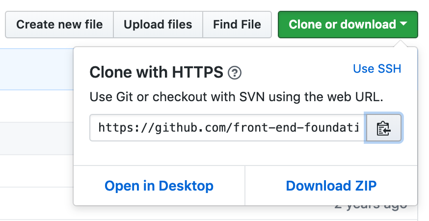

# VI - Basilica! JavaScript and SASS

**Important:** DO NOT DOWNLOAD THE ZIP. See the command line instructions below.

## Homework
 
* Change the popover behavior so it displays a different message for each of the three navigation buttons
* Develop a final project proposal

## Command Line

Navigate to your Desktop (or wherever you want to work from) in the terminal. 

```sh
$ cd ~ // go to your home directory OR
$ cd // copy and paste the folder you want to go to OR
$ cd ~/Desk // tab completion
$ pwd // print working directory
```

Next, copy the URI for today's git repo:



Finally `clone` the repo into your Desktop (or other chosen directory) and `cd` into it.

```sh
$ git clone https://github.com/front-end-foundations/6-Basilica.git
$ cd 6-Basilica
```

## Node Package Manager

Since there is an existing `package.json` file we will not run `npm init`. 

Examine `package.json`. We are using [Browser Sync](https://www.browsersync.io) as our sample application.

Note the NPM script using the Browser Sync [Command Line (CLI) documentation](https://www.browsersync.io/docs/command-line):

```js
  "scripts": {
    "startmac": "browser-sync start --directory --server 'app' --files 'app' --browser chrome",
    "startpc": "browser-sync start --directory --server \"app\" --files \"app\" --browser chrome.exe"
  },
```

Note the `.gitignore` file as well.

Run `npm install`:

```sh
$ npm i
```

And run the process:

```sh
$ npm run startmac // or startpc
```

## SASS

[Syntactically Awesome Style Sheets](https://sass-lang.com) - SASS [adds features](http://sass-lang.com/guide) to css.

You can use an app, an NPM package, or an editor Extension (e.g. [VS Code Live SASS Compiler](https://github.com/ritwickdey/vscode-live-sass-compiler)) to process SASS.

Apps that allow you to use SASS include:

* [Koala](http://koala-app.com)
* [Scout app](http://scout-app.io/)
* and [more](https://sass-lang.com/install)

Note: the steps below were completed in the last class.

Setting up SASS includes creating and defining an input folder for scss and an output folder for css.

For VS Code you need to configure the Live SASS Compiler plug in in either a global or on a per project basis.

Here is our minimal sample configuration (check out the `.vscode` directory) for today's project:

```
{
  "liveSassCompile.settings.formats": [
    {
      "savePath": "/app/css/",
      "format": "expanded"
    }
  ],
  "liveSassCompile.settings.excludeList": [
    "**/node_modules/**",
    ".vscode/**",
    "**/other/**"
  ]
}
```

Last class we:

* Created a `scss` directory in the project folder 
* Saved or copied `styles.css` into it renamed to `styles.scss` - note the `.scss` suffix

Note: for today's class, I have created a folder `scss/imports` and a new file `scss/imports/_base.scss` together with changes to the `styles.scss` file. Examine them now. We will come back to them later.

Run the SASS processor and test your setup by temporarily adding the following to the `_base.scss` file:

```css
* { color: red !important }
```

And then view the output. Note the auto prefixing. See also git [postcss-preset-env](https://github.com/csstools/postcss-preset-env)

### Sass

You can also use NPM to install [sass](https://www.npmjs.com/package/sass) and use this via an npm script.

Turn off "Watch Sass" in VS Code if its running.

Install sass via NPM as a developmental dependency.

`npm install sass --save-dev`

Add a script for processing:

```js
  "scripts": {
    ...
    "startSass": "sass  scss/styles.scss app/css/styles.css --watch --source-map"
  },
```

Dart Sass CLI [documentation](https://sass-lang.com/documentation/file.SASS_REFERENCE.html)

To run both scripts at the same time:

```js
"scripts": {
  ...
  "start": "npm run startmac & npm run startSass"
},
```

And run `npm start` (the word 'run' is optional in this case).

Test it by re-adding the following to the `_base.scss` file:

```css
* { color red !important }
```

#### SASS variables

```sass
$basil-green: #88a308;
$breakpoint-med: 640px;
```

Usage example:

```css
* { color: $basil-green }
```

Here is a larger example including variables for breakpoints and more:

Example:

```css
$break-five: 81.25em;
// 1300px
$break-four: 71.25em;
// 1140
$break-three: 61.25em;
// 980
$break-two: 46.25em;
// 760
$break-one: 22.5em;
// 360

//ADDITIONAL CONVERSIONS
// 67.5rem    1080px
// 1.125rem   18px
// 1rem       16px
// 0.875rem   14px
// .75rem     12px
$radius: .25rem;

$fonts: 'Source Sans Pro', Helvetica, Clean, sans-serif;

$basil-green: #88a308;
$link: #007eb6;
$cyan: #00aeef;
$cyan10: #e2f4fd;
$blue100: #003366;
$blue50: #5997b1;
$webdarkcyan: #006991;
$specialblue: #007eb6;
$text: #444;
$caption: #808285;
$borders: #dcdcdc;
$borders-callout: #820064;
$lightgray: #F2F2F1;
$gray10: #ebeced;
$gray25: #d0d2d3;
$gray50: #abacad;
$gray75: #808285;
$gray100: #585858;
$fushia100: #820064;
$green100: #339548;
$red100: #cc3333;


$blk-100: rgba(0,0,0,1);
$blk-095: rgba(0,0,0,0.95);
$blk-090: rgba(0,0,0,0.90);
$blk-085: rgba(0,0,0,0.85);
$blk-080: rgba(0,0,0,0.80);
$blk-075: rgba(0,0,0,0.75);
$blk-070: rgba(0,0,0,0.70);
$blk-065: rgba(0,0,0,0.65);
$blk-060: rgba(0,0,0,0.60);
$blk-055: rgba(0,0,0,0.55);
$blk-050: rgba(0,0,0,0.50);
$blk-040: rgba(0,0,0,0.40);
$blk-010: rgba(0,0,0,0.10);

$gray-100: rgba(51,51,51,1);
$gray-095: rgba(51,51,51,0.95);
$gray-090: rgba(51,51,51,0.90);
$gray-085: rgba(51,51,51,0.85);
$gray-080: rgba(51,51,51,0.80);
$gray-075: rgba(51,51,51,0.75);
$gray-070: rgba(51,51,51,0.70);
$gray-065: rgba(51,51,51,0.65);
$gray-060: rgba(51,51,51,0.60);
$gray-055: rgba(51,51,51,0.55);
$gray-050: rgba(51,51,51,0.50);
$gray-040: rgba(51,51,51,0.40);
$gray-010: rgba(51,51,51,0.10);
```

Add the above to a new `imports/_variables.scss` file and include it at the top of `styles.scss`: `@import 'imports/variables';`.

#### SASS nesting 

Sass will let you nest your CSS selectors in a way that follows the same visual hierarchy of your HTML. Be aware that overly nested rules will result in over-qualified CSS that could prove hard to maintain and is generally considered bad practice.

One of the best things about nesting in SASS is how it allows you to simplify media queries and keep them aligned with the selector.

#### SASS Partials and Imports

Allow you to create separate function or feature specific style sheets using [imports](https://sass-lang.com/guide#topic-4) and helps maintain a large code base.

Examples [Bootstrap](https://getbootstrap.com) and its [SASS roots](https://github.com/twbs/bootstrap-sass)

Create `imports/_nav.scss` and cut the nested nav related material from `_base.scss` into it. Add it to the main stylesheet.

<!-- * Create `scss/imports`
* Cut and copy the newly nested code for header into a new document `scss/imports/_header.scss`
* import it into `styles.scss` by adding `@import "imports/header";` to that file -->

Note the underscore in the include.

Create `imports/_header.scss` and add the following (remove the header related material from `_base.scss `).

```css
header {
  position: relative;
  height: 120px;
  background: var(--basil-green);
  border-radius: 8px 8px 0px 0px;
  
  h1 {
    background: url(img/basil.png) no-repeat;
    font-family: FuturaStdLight, sans-serif;
    font-weight: normal;
    color: #fff;
    font-size: 5rem;
    @media (min-width: 640px) {
      padding-left: 240px;
      padding-top: 90px;
      transform: translate(-100px, -80px);
      background-position: top left;
    }
  }
  
  a.beta {
    background: url('img/burst.svg') no-repeat;
    color: #fff;
    font-size: 1.5rem;
    position: absolute;
    top: -20px;
    right: 10px;
    width: 85px;
    height: 85px;
    line-height: 85px;
    text-align: center;
    text-transform: uppercase;
    transform: rotate(20deg);
    transition: all 1s ease;
  }
  a.beta:hover {
    transform: rotate(0deg) scale(1.2);
  }
}
```

Note the use of nesting to perform the media query.

We can also use nesting and an ampersand for the hover pseudo selector:

```css
a.beta {
  ...
  &:hover {
    transform: rotate(0deg) scale(1.2);
  }
}
```

Note: SASS allows you to use JavaScript style comments - `//`. These comments do not get compiled into the css file. Traditional CSS comments ( `/* ... */` ) do.

<!-- `@import 'app/css/futura/stylesheet.css';` vs `@import url(futura/stylesheet.css);` -->

## CSS Grid

The [CSS Grid Cheatsheet](https://css-tricks.com/snippets/css/complete-guide-grid/) on CSS Tricks.

Flexbox operates in a [single axis](https://hackernoon.com/the-ultimate-css-battle-grid-vs-flexbox-d40da0449faf). CSS Grid operates in both x and y.

Our use of Flexbox to style the content columns operates in a single (horizontal or x) dimension. We can use CSS Grid but only need to specify one dimension.

Note that in our document these are only used in wide screens:

```css
@media (min-width: 640px) {
  .content{
    display: grid;
    grid-template-columns: 20% 20% 20% 20% 20%;
    grid-template-rows: 20% 20% 20% 20% 20%;
    grid-gap: 20px;
  }
  article {
    grid-row-start: 1;
    grid-column-start: 1;
    grid-column-end: span 3;
  }
  aside {
    grid-row-start: 1;
    grid-column-start: 4;
    grid-column-end: span 2;
    
    background: #f5faef;
    box-shadow: -4px 0px 4px #ddd;
  }
}
```

We have some problems here due to the use of percentages (`20% * 5 + the grid-gap`).

Create a new partial `_layout.scss` and cut and paste the following code into it.

```css
article,
aside {
  padding: 1rem;
}

@media (min-width: 600px){
  .content {
      display: grid;
      grid-template-columns: 3fr 2fr;
      grid-column-gap: 1rem;
  }
  article {
      grid-column-start: 1;
  }
  aside {
      grid-column-start: 2;
      background-color: #f5faef;
      box-shadow: -4px 0px 4px #ddd;
      padding: 0.5rem;
  } 
}

footer {
  background-color: var(--basil-green);
  padding: 1rem;
  border-radius: 0 0 4px 4px;
  margin-bottom: 2rem;
}
```

We edited it to use `fr` - fractions:

```css
@media (min-width: 600px){
    .content {
        display: grid;
        grid-template-columns: 3fr 2fr;
        grid-column-gap: 1rem;
    }
    article {
        grid-column-start: 1;
    }
    aside {
        grid-column-start: 2;
        background-color: #f5faef;
        box-shadow: -4px 0px 4px #ddd;
        padding: 0.5rem;
    } 
}
```

We can also use the repeat property. The `repeat` property requires a different property for the children:

```css
@media (min-width: 600px){
  .content {
      display: grid;
      grid-template-columns: repeat(5, 1fr);
      grid-column-gap: 1rem;
  }
  article {
    grid-column: span 3;
  }
  aside {
    grid-column: span 2;
    background-color: #f5faef;
    box-shadow: -4px 0px 4px #ddd;
    padding: 0.5rem;
  } 
}
```

Note: while it is possible to use CSS Grid for the entire layout, it is not really necessary and adds unnecessary complexity.

However we will use `grid-template-areas` in order to show the principle and a nested grid:

```css
article,
aside {
  padding: 1rem;
}

@media (min-width: 600px){
  body {
    display: grid;
    grid-template-areas: 
    "header" 
    "nav" 
    "content"
    "footer";
  }
  header {
    grid-area: header;
  }
  nav {
    grid-area: nav;
  }
  .content {
    grid-area: content;
    display: grid;
    grid-template-columns: repeat(5, 1fr);
    grid-column-gap: 1rem;
  }
  article {
    grid-column: span 3;
  }
  aside {
    grid-column: span 2;
    background-color: #f5faef;
    box-shadow: -4px 0px 4px #ddd;
    padding: 0.5rem;
  } 
  footer {
    grid-area: footer;
  }
}

footer {
  background-color: var(--basil-green);
  padding: 1rem;
  border-radius: 0 0 4px 4px;
  margin-bottom: 2rem;
}
```

Commit your changes and checkout the `spring2019-done` branch.

## JavaScript

## Node Demo

In a new temp folder: `basilnode.js`

```sh
$ mkdir node
$ cd node
$ touch basilnode.js
$ npm init -y
$ npm install random-number
```

```js
const randomNumber = require('random-number');

const randomIndex = randomNumber({
  min: 0,
  max: 4,
  integer: true
});

console.log(randomIndex);
console.log(typeof randomNumber);
console.log(typeof randomIndex);
```

```sh
$ node basilnode.js
```

```js
const randomNumber = require('random-number');

const basilChef = ['mama', 'papa', 'baby'];
const basilTexture = ['greasy', 'frozen', 'spicy'];

function randomItem(array) {
  const randomIndex = randomNumber({
    min: 0,
    max: array.length - 1,
    integer: true,
  });
  return array[randomIndex];
}

console.log(basilChef);
console.log(basilChef[0]);
console.log(basilChef.length);

console.log(randomItem(basilChef));
```

```sh
$ node basilnode.js
```

```js
const randomNumber = require('random-number');

const basilChef = ['mama', 'papa', 'baby'];
const basilTexture = ['greasy', 'frozen', 'spicy'];

function randomItem(array) {
  const randomIndex = randomNumber({
    min: 0,
    max: array.length - 1,
    integer: true,
  });
  return array[randomIndex];
}

function makeBasil() {
  return randomItem(basilChef) + '\'s' + ' ' + randomItem(basilTexture) + ' basil';
}

console.log(makeBasil());
```

```js
function makeBasil() {
  return (
    '<h2>' + randomItem(basilChef) + "'s" + ' ' + randomItem(basilTexture) + ' basil' + '</h2>'
  );
}
```

Template strings:

```js
function makeBasil() {
  return (
    `<h2>${randomItem(basilChef)}'s ${randomItem(basilTexture)} basil</h2>`
  );
}
```

Create `scripts.js` in the `js` folder and add it to `index.html`:

```html
<script src="js/scripts.js"></script>
```

In `scripts.js`:

```js
const el = document.querySelector('div.content h2')

function randomName(array) {
  const min = 0;
  const max = array.length - 1
  const randomIndex = Math.floor(Math.random() * (max + 1));
  return array[randomIndex];
}

const makeBasil = () => {
  const basilChef = ['mama', 'papa', 'baby'];
  const basilTexture = ['greasy', 'frozen', 'spicy'];

  return `
  <h2>${randomName(basilChef)}'s ${randomName(basilTexture)} basil</h2>
  `
};

console.log(makeBasil());

el.innerHTML = makeBasil()
```

```css
h2 {
  font-size: 2rem;
  text-transform: capitalize
}
```

## Popover

Building the popover window.

Create and style a div on the bottom of the page.

```html
<div class="betainfo">
    <h2>In Beta</h2>
    <p>Information about the beta program.</p>
</div>
```

In `_header.scss`:

```css
.betainfo {
  width: 300px;
  height: 150px;
  padding: 0.5rem;
  background: #fff;
  border: 4px solid var(--orange);
  border-radius: 0.25rem;
  position: fixed;
  top: calc(50% - 75px);
  left: calc(50% - 150px);
  /*display: none;*/
}
```

Uncomment `display: none` and add a `show` class:

```css
.show {
  display: block;
}
```

Test by adding the class in the inspector and make any needed corrections.

Code the `.beta` button to show the window.

Create a variable for the beta button, attach an event listener to it, and create a function to handle the event.

```js
var popoverWindow = document.querySelector('.betainfo');
var betaButton = document.querySelector('.beta');

betaButton.addEventListener('click', showPopover);

function showPopover() {
    popoverWindow.classList.toggle('show');
    event.preventDefault();
}
```

## DOM Scripting Review:

* Use [querySelector](https://developer.mozilla.org/en-US/docs/Web/API/Document/querySelector) to find the first matching element on a page `var popoverWindow = document.querySelector('.betainfo');`
* Use [querySelectorAll()](https://developer.mozilla.org/en-US/docs/Web/API/ParentNode/querySelectorAll) to find all matching elements on a page
* Use [addEventListener('event', function)](https://developer.mozilla.org/en-US/docs/Web/API/EventTarget/addEventListener), to listen for events on an element. You can find a full list of available events on the [Mozilla Developer Network](https://developer.mozilla.org/en-US/docs/Web/Events)
* Use [Functions](https://developer.mozilla.org/en-US/docs/Glossary/Function) to store and execute your commands
* Use [classList](https://plainjs.com/javascript/attributes/adding-removing-and-testing-for-classes-9/) to add, remove, toggle, list and test for classes:

### Add Another Close Method

Add html to the betainfo:

```html
<div class="betainfo">
    <h2>In Beta</h2>
    <p>Information about the beta program.</p>
        <!-- NEW -->
    <a class="closer" href="#0">✖︎</a> 
</div>
```

Style it:

```css
.closer {
  position: absolute;
  top: -10px;
  right: -10px;
  width: 1.5rem;
  height: 1.5rem;
  background: #fff;
  color: var(--orange);
  border: 3px solid #eabc5a;
  border-radius: 50%;
  text-align: center;
  line-height: 0.25rem;
  cursor: pointer;
}
```

Adjust the line height property to center the ✖︎.

Extend the functionality of the script.

```js
var popoverWindow = document.querySelector('.betainfo');
var betaButton = document.querySelector('.beta');
var popoverCloseButton = document.querySelector('.closer');  // NEW

betaButton.addEventListener('click', showPopover);
popoverCloseButton.addEventListener('click', showPopover);  // NEW

function showPopover() {
    popoverWindow.classList.toggle('show');
    event.preventDefault();
}
```

Add a shader div after the body tag to block access to the page and make the window modal:

```html
<div class="shader"></div>
```

Add styling:

```css
.shader {
    position: absolute;
    top: 0;
    left: 0;
    background: rgba(0, 0, 0, 0.5);
    height: 100vh;
    width: 100vw;
    display: none;
}
```

Add it to the script:

```js
var popoverWindow = document.querySelector('.betainfo'); 
var betaButton = document.querySelector('.beta');
var popoverCloseButton = document.querySelector('.closer'); 
var shader = document.querySelector('.shader')  // NEW

betaButton.addEventListener('click', showPopover);
popoverCloseButton.addEventListener('click', showPopover); 
shader.addEventListener('click', showPopover)  // NEW

function showPopover() {
    popoverWindow.classList.toggle('show'); 
    shader.classList.toggle('show')  // NEW
    event.preventDefault();
}
```

Test. Change `position absolute` to `position fixed` and add a `z-index`.

<!-- Check the cascade and add z-indexes as appropriate.

Aside: Killing the scrollbar

```js
function showPopover() {
    popoverWindow.classList.toggle('show'); // NEW
    shader.classList.toggle('show')  // NEW
    body.classList.toggle('hidden')
    event.preventDefault();
}
```

```css
.hidden header,
.hidden nav,
.hidden .content,
.hidden footer
{
  display: none;
}
``` -->

## A Dynamic Popover

We will recreate the popover HTML using JavaScript. One advantage of making our popover dynamic is that we will be able to reuse it elsewhere on our page.

Delete the betainfo div at the bottom of our page:

```html
<!-- <div class="betainfo">
    <h2>In Beta</h2>
    <p>Information about the beta program.<p>
    <a class="closer" href="#0">X</a>
</div> -->
```

And remove the JavaScript related to it in scripts.js.

### createElement

You can use the `document.createElement()` method to create an element.

In the browser's console e.g.:

```js
> var div = document.createElement('div');
> div
```

You can manipulate an element created with `createElement()` like you would any other element in the DOM. Add classes, attributes, styles, and more.

In the browser's console:

```js
var div = document.createElement('div');
div.className = 'new-div';
div.id = 'new-div';
div.setAttribute('data-div', 'new');
div.style.color = '#fff';
div.style.backgroundColor = 'rebeccapurple';
// add some text
div.textContent = 'Nice work, dude!';
div
```

### Appending Content

After you create an element, you need a way to add it to your page. JavaScript provides a handful of methods you can use to add an element before, after, or within some other element in the DOM.

First grab a target:`

```js
// Get the element to add your new HTML element before, after, or within
var target = document.querySelector('.content h2');
```

Then use the appropriate method:

```js
// Inject the `div` element before the element
target.before(div);

// Inject the `div` element after the element
target.after(div);

// Inject the `div` element before the first item *inside* the element
target.prepend(div);

// Inject the `div` element after the first item *inside* the element
target.append(div);
```

Try it again with the `betainfo` class. **Remove the `display: none` property from the betainfo css first.**

```js
var div = document.createElement('div');
div.className = 'betainfo';
div.style.color = '#fff';
div.style.backgroundColor = 'rebeccapurple';
// add some text
div.textContent = 'Nice work, dude!';
```

```js
div
var target = document.querySelector('header');
target.before(div);
```

### innerHTML

The innerHTML property can be used to both get and set HTML content in an element.

In the console:

```js
var elem = document.querySelector('.content');
elem
// Get HTML content
var html = elem.innerHTML;
html

// Set HTML content
elem.innerHTML = '<p>We can dynamically change the HTML including HTML elements like <a href="#">this link</a>.</p>';

// Add += HTML to the end of an element's existing content
elem.innerHTML = elem.innerHTML + '<p>Add this after what is already there.</p>';
elem.innerHTML += '<p>Add this after what is already there.</p>';

// Add HTML to the beginning of an element's existing content
elem.innerHTML = '<p>We can add this to the beginning.</p>' + elem.innerHTML;
```

Note: there is also an `innerText` property available. It works just like `innerHTML`, but only gets the text of an element and omits the markup.

```js
var elem = document.querySelector('.content');
elem.innerText = '<p>Welcome back my friends to the show that never ends.</p>';
```

Notice how it show the HTML tags as text.

Since we are creating our div we deleted the current 'hardcoded' div:

```html
<div class="betainfo">
    <h2>In Beta</h2>
    <p>Information about the beta program.<p>
    <a class="closer" href="#0">X</a>
</div>
```

Add to `scripts.js`:

```js
var betaButton = document.querySelector('.beta')
betaButton.addEventListener('click', makePopover)

function makePopover() {
  var popover = document.createElement('div');
  popover.classList.add('betainfo');
  var popoverContent = '<h2>Testing</h2><p>Information about the beta program.<p><div class="closer" href="#0"><div>✖︎</div></div>'; // NEW
  popover.innerHTML = popoverContent;
  document.querySelector('body').append(popover);
}
```

Click on the beta button and note the div in the source html. 

Note the long line for the popoverContent variable. Fortunately we can use a template string instead.

Note the use of back ticks:

```js
var popoverContent = `
<h2>In Beta</h2>
<p>Information about the beta program.<p>
<div class="closer" href="#0">
<div>✖︎</div>
</div>
`
```

E.g.:

```js
var betaButton = document.querySelector('.beta')
betaButton.addEventListener('click', makePopover)

function makePopover() {
  var popover = document.createElement('div');
  popover.classList.add('betainfo');
    var popoverContent = `
  <h2>In Beta</h2>
  <p>Information about the beta program.<p>
  <div class="closer" href="#0">
    <div>✖︎</div>
  </div>
  `
  popover.innerHTML = popoverContent;
  document.querySelector('body').append(popover);
}
```

Now, let's add the close functionality ('destroyPopover') back in using the opposite of `append()`: `remove()`:

```js
var betaButton = document.querySelector('.beta')
betaButton.addEventListener('click', makePopover)

function makePopover() {
  var popover = document.createElement('div');
  popover.classList.add('betainfo');
  var popoverContent = `
  <h2>In Beta</h2>
  <p>Information about the beta program.<p>
  <div class="closer" href="#0">
    <div>✖︎</div>
  </div>
  `
  popover.innerHTML = popoverContent;
  document.querySelector('body').append(popover);
  
  var popoverCloseButton = document.querySelector('.closer') // NEW
  popoverCloseButton.addEventListener('click', destroyPopover) // NEW
}
// NEW
function destroyPopover() {
    document.querySelector('.betainfo').remove();
    event.preventDefault()
}
```

Note that we do not create `var popoverCloseButton` or attach an event listener until we have created a popover. Otherwise we would get an error:

```js
var popoverCloseButton = document.querySelector('.closer') // NEW
popoverCloseButton.addEventListener('click', destroyPopover) // NEW

// NEW
function destroyPopover() {
    document.querySelector('.betainfo').remove();
    event.preventDefault()
}
```

We can use 'event delegation' in order to further abstract the click event so we can use it elsewhere on the page.

Replace the event listener and add a new function:

```js
// betaButton.addEventListener('click', makePopover)
document.addEventListener('click', decide, false)

function decide() {
    console.log(event.target);
}
```

E.g.:

```js
// betaButton.addEventListener('click', makePopover)
document.addEventListener('click', decide, false)

function decide() {
    console.log(event.target);
}

function makePopover() {
  var popover = document.createElement('div');
  popover.classList.add('betainfo');
  var popoverContent = `
  <h2>In Beta</h2>
  <p>Information about the beta program.<p>
  <div class="closer" href="#0">
    <div>✖︎</div>
  </div>
  `
  popover.innerHTML = popoverContent;
  document.querySelector('body').append(popover);
  
  var popoverCloseButton = document.querySelector('.closer') 
  popoverCloseButton.addEventListener('click', destroyPopover) 
}

function destroyPopover() {
    document.querySelector('.betainfo').remove();
    event.preventDefault()
}
```

Note that you can see whatever you click on in the console.

### matches

The `matches()` method lets you check if an element would be selected by a particular selector. It returns true if the element is a match, and false when it’s not. It can be an alternative to using `element.classList.contains('.someclass')`.

```js
var elem = document.querySelector('.click-me');

// Match by an ID
if (elem.matches('#first-button')) {
    // Do something...
}

// Match by a class
if (elem.matches('.button-submit')) {
    // Do something...
}

// Match by a data attribute
if (elem.matches('[data-click-me]')) {
    // Do something...
}

// Match by a data attribute and value
if (elem.matches('[data-click-me="button-submit"]')) {
    // Do something...
}

// Match by multiple selectors
// Returns true when element contains all selectors
if (elem.matches('.click-me.button-submit[data-click-me]')) {
    // Do something...
}

// Match by one of several selectors
// Returns true when element contains at least one of the selectors
if (elem.matches('.click-me, .button-submit, [data-click-me]')) {
    // Do something...
}
```

Add an `if` statement to run `makePopover` if the item clicked on (`event.target`) matches the beta button:

```js
function decide() {
    console.log(event.target);
    if (event.target.matches('.beta')) {
        makePopover();
    } 
}
```

<!-- If clicking on the x isn't working you can add a class to it:

```js
    var popoverContent = `
    <h2>In Beta</h2>
    <p>Information about the beta program.<p>
    <div class="closer" href="#0">
    <div class="closex">✖︎</div> 
    </div>
    `
```

Then use it in an `else if` to remove the popover:

```js
function decide() {
    console.log(event.target);
    if (event.target.matches('.beta')) {
        makePopover();
    } else if (event.target.matches('.closex')) {
        destroyPopover()
    }
}
``` -->

Let's use our new popover to display a message when the user clicks on any of the three nav buttons:


Add a class `it` to each of the nav bottons:

```html
<nav>
    <p>Bonjour Monsieur Ferme</p>
    <ul>
        <li class="nav-pickit"><a class="it" href="#">pick it</a></li>
        <li class="nav-cookit"><a class="it" href="#">cook it</a></li>
        <li class="nav-storeit"><a class="it" href="#">store it</a></li>
    </ul>
</nav>
```

Create two new variables with the text for our messages:

```js
// var betaButton = document.querySelector('.beta');
document.addEventListener('click', decide, false);

var betaContent = `
<h2>In Beta</h2>
<p>Information about the beta program.<p>
<div class="closer" href="#0">
<div class="closex">✖︎</div>
</div>
`

var itContent = `
<h2>Coming Soon</h2>
<p>This feature coming soon.<p>
<div class="closer" href="#0">
<div class="closex">✖︎</div>
</div>
`
```

Use the first new variable as the source for our popover content:

```js
function makePopover() {
    var popover = document.createElement('div');
    popover.classList.add('betainfo');
    var popoverContent = betaContent; // NEW
    popover.innerHTML = popoverContent;
    document.querySelector('body').append(popover);
    
    var popoverCloseButton = document.querySelector('.closer')
    popoverCloseButton.addEventListener('click', destroyPopover)
}
```

Now let's decide which item is clicked on and use that to determine the message::

```js
function decide() {
  console.log(event.target);
  if (event.target.matches('.beta')) {
      makePopover(betaContent); // NEW
  } else if (event.target.matches('.it')) { // NEW
      makePopover(itContent); // NEW
  } else if (event.target.matches('.closex')) {
      destroyPopover()
  }
}
```

The line `makePopover(itContent);` passes the variable we want to display to the makePopover function.

Let's use that by first catching it or passing it in to the function as a variable:

```js
function makePopover(content) {
  ...
}
```

And then making the contents of the popover dependent on the value of the variable:

```js
function makePopover(content) {
  var popover = document.createElement('div');
  popover.classList.add('betainfo');
  popover.innerHTML = content; 
  document.querySelector('body').append(popover);
  
  var popoverCloseButton = document.querySelector('.closer')
  popoverCloseButton.addEventListener('click', destroyPopover)
}
```

Because we are using event delegation we can remove the following uneeded lines:

```js
// var popoverCloseButton = document.querySelector('.closer')
// popoverCloseButton.addEventListener('click', destroyPopover)
```

Here is the final script:

```js
document.addEventListener('click', decide, false);

var betaContent = `
<h2>In Beta</h2>
<p>Information about the beta program.<p>
<div class="closer" href="#0">
<div class="closex">✖︎</div>
</div>
`

var itContent = `
<h2>Coming Soon</h2>
<p>This feature coming soon.<p>
<div class="closer" href="#0">
<div class="closex">✖︎</div>
</div>
`

function decide() {
    console.log(event.target);
    if (event.target.matches('.beta')) {
        makePopover(betaContent); 
    } else if (event.target.matches('.it')) { 
        makePopover(itContent); 
    } else if (event.target.matches('.closex')) {
        destroyPopover()
    }
}

function makePopover(content) { 
    if (document.querySelector('.betainfo')) {
        destroyPopover();
    }
    var popover = document.createElement('div');
    popover.classList.add('betainfo');
  
    popover.innerHTML = content; 
    document.querySelector('body').append(popover);
  
    function destroyPopover() {
      document.querySelector('.betainfo').remove();
      event.preventDefault()
    }
  }

function destroyPopover() {
    event.preventDefault()
    var targetElem = document.querySelector('.betainfo')
    targetElem.remove();
}
```

## Debugging

Note that the popovers accumulate and become difficult to destroy.

Let's add a test to see if a popover already exists and destroy it before creating a new one:

```js
function makePopover(content) {
    if (document.querySelector('.betainfo')) { //NEW
        destroyPopover(); //NEW
    } //NEW
    var popover = document.createElement('div');
    popover.classList.add('betainfo');
    var popoverContent = content;
    popover.innerHTML = popoverContent;
    document.querySelector('body').append(popover);
    
    var popoverCloseButton = document.querySelector('.closer')
    popoverCloseButton.addEventListener('click', destroyPopover)
}
```

